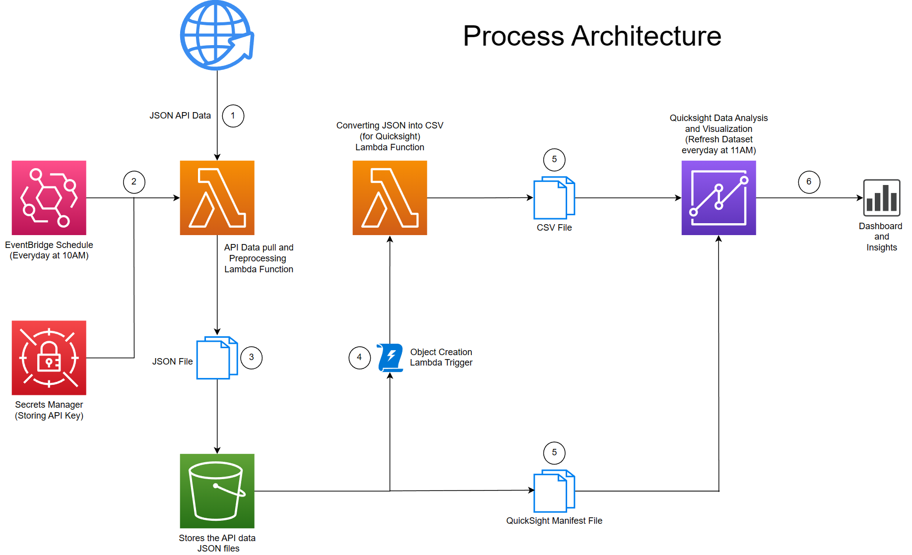

# API Data Ingestion and Analysis

In this project, CDK stack code, implemented in Python (runtime: 3.7) is used to deploy various AWS resources and techniques which takes in api data from the website https://openweathermap.org/ using a secret API key in the JSON format.
The JSON file is then preprocessed using a lambda function and stored in an S3 bucket. Another lambda function is used which takes in this stored JSON file and converts it into a Quicksight data-source CSV file. A trigger is set on this lambda function
to automatically get invoked whenever an object is created into the S3 bucket mentioned earlier. Using a manifest file placed inside the same s3 bucket and the CSV file output from the second lambda function, detailed dashboards and analysis are carried out
using Quicksight. The process diagram is shown below:

<ul style="list-style-type:circle">
  <li>Coffee</li>
  <li>Tea</li>
  <li>Milk</li>
</ul>
